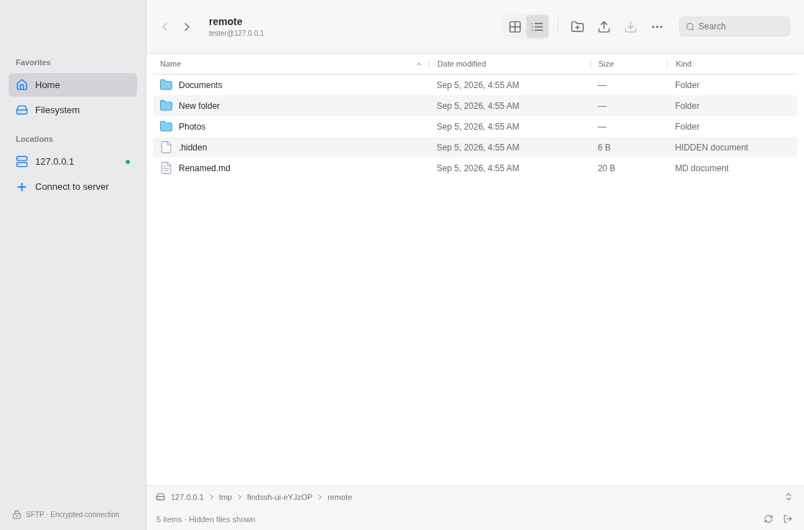

<p align="center">
  
</p>

# FindSSH

**Your server, in a familiar file browser.**

A Finder-style macOS app for browsing servers over SSH and SFTP. Connect with an IP address, hostname, or Tailscale name, then move files between your Mac and your server. No cloud account or server-side installation required beyond SSH with SFTP enabled.

[](https://github.com/ahmadhajji/findssh/actions/workflows/ci.yml)
[](https://github.com/ahmadhajji/findssh/releases/latest)
[](LICENSE)



_The app running against a disposable local SFTP test server. Window decorations vary by platform._

## Download

Requires **macOS 13 or later**.

| Your Mac                    | Installer                                                                                                            |
| --------------------------- | -------------------------------------------------------------------------------------------------------------------- |
| Apple Silicon, M1 and later | [Download for Apple Silicon](https://github.com/ahmadhajji/findssh/releases/download/v0.1.1/FindSSH-0.1.1-arm64.dmg) |
| Intel                       | [Download for Intel](https://github.com/ahmadhajji/findssh/releases/download/v0.1.1/FindSSH-0.1.1-x64.dmg)           |

[All releases, ZIP builds, and SHA-256 checksums](https://github.com/ahmadhajji/findssh/releases). Open the DMG and drag FindSSH into Applications.

### First launch and signing

**FindSSH is ad hoc signed and is not notarized by Apple.** This free signature requires no Apple Developer account. It lets macOS check the app bundle's integrity, but it does not establish a verified developer identity. It is different from an Apple Development or Developer ID certificate.

If macOS blocks the first launch:

1. Try opening FindSSH from Applications once.
2. Open **System Settings → Privacy & Security**.
3. Click **Open Anyway** for FindSSH, then confirm **Open**.

This is [Apple's documented approval flow](https://support.apple.com/en-gb/102445) for trusted apps from unidentified developers or without notarization. The available options depend on macOS and device policy; ad hoc signing cannot guarantee an override. Neither unsigned nor ad hoc signed apps have one universal Gatekeeper outcome. We do not ask you to disable Gatekeeper or remove quarantine using Terminal. If approval is unavailable, see [local development](docs/DEVELOPMENT.md) or consult your Mac's administrator.

Both architectures use explicit ad hoc signing. CI checks the bundle signature and runs the packaged app; the [release verification workflow](.github/workflows/verify-release.yml) also checks downloaded DMG and ZIP contents. See [Mac verification](docs/MAC-VERIFICATION.md) for commands and the installation checklist.

## What you can do

- Connect with a password, SSH key, SSH agent, or keyboard-interactive authentication.
- Browse home and root in list or icon view, sort columns, show hidden files, and jump to a path.
- Upload and download files or folders. Drag files in from Finder.
- Copy or move between remote folders, create folders, rename, and inspect file details.
- Edit UTF-8 text with conflict detection and atomic saves.

Deletion is permanent and asks for confirmation. Transfers reject existing destination names. The editor accepts files up to 2 MB and requires the OpenSSH POSIX rename extension for saves. Read the [usage guide and keyboard shortcuts](docs/USAGE.md) before working with important files.

## Connect

Enter the server address and your SSH username, then click **Connect**. Approve the server fingerprint after comparing it with your server, and enter a password or key passphrase if prompted. Tailscale must already be connected on your Mac to use tailnet addresses.

FindSSH opens the remote account's home directory. **Filesystem** in the sidebar opens `/`. Your server account's permissions apply throughout; the app does not elevate access.

Passwords and passphrases are never saved. Connections go directly from your Mac to the SSH server. There is no telemetry or analytics. See [security and local data](SECURITY.md).

## Build and contribute

```sh
git clone https://github.com/ahmadhajji/findssh.git
cd findssh
pnpm install --frozen-lockfile
pnpm dev
```

Requires Node.js 22.12 or later in the Node 22 series and pnpm 10.30.3. Build Mac installers with `pnpm package:mac --arm64` or `pnpm package:mac --x64` on macOS. Output goes to `release/`.

[Development and architecture](docs/DEVELOPMENT.md) · [Contributing](CONTRIBUTING.md) · [Changelog](CHANGELOG.md) · [Report a bug](https://github.com/ahmadhajji/findssh/issues/new/choose)

## Scope

FindSSH provides the core remote file-manager workflow. Column/gallery views, tabs, Finder tags, binary previews, volume mounting, remote Trash/undo, SSH config aliases/ProxyJump, recursive server search, and resumable transfer queues are not implemented. Directory symlinks can be opened; transfers refuse symlinks. There is one active connection per app instance.

FindSSH is independent software, with original artwork and no Apple Finder code or assets. It is not affiliated with Apple and does not reproduce every Finder feature. Available under the [MIT license](LICENSE).
